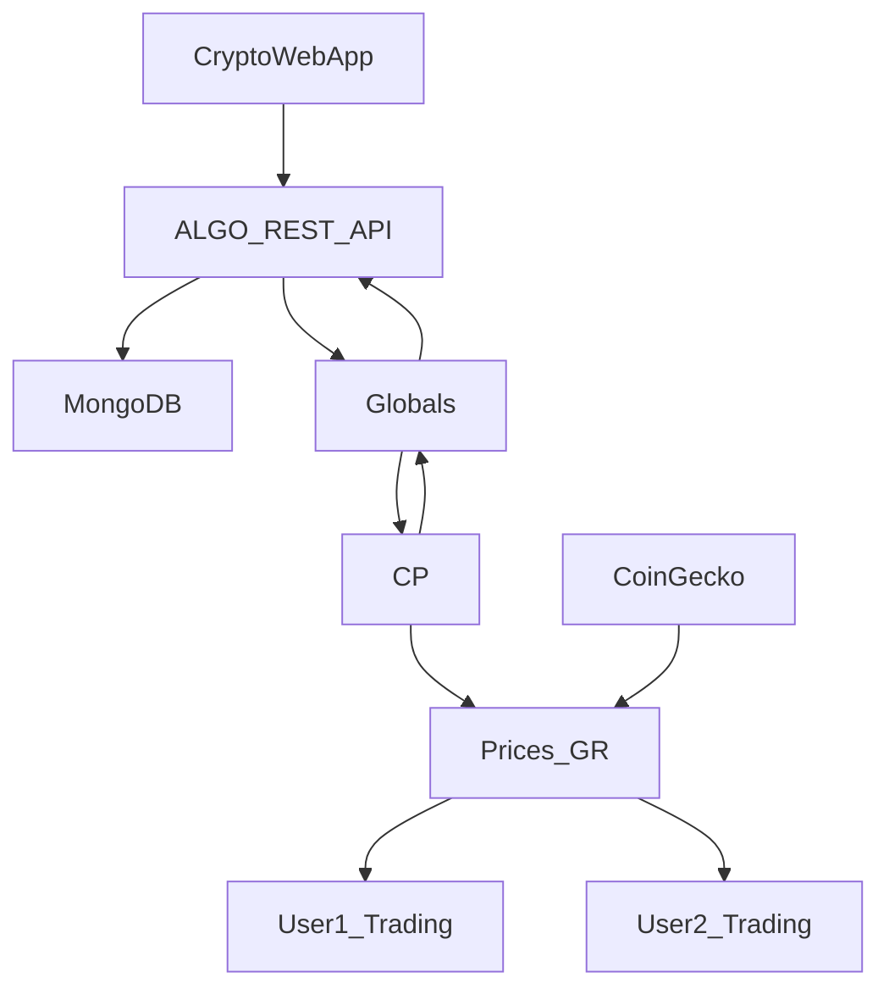

# Algo

You will need to add a config.js file

{
	"url":"<coingecko_price_api>"
	"mongoDB": "<mongoDB_url>"
}

This program kicks off a CheckProfiles (CP) goroutine immeditaly once the service starts. This goroutine is continously looping and checking to see if any users were added to the global variables. Once a user is added via a POST request then the CP will kick off a single price goroutine and the first or any additional algorithm goroutines. There will always only be at one time a single price go routine that will feed the newest price from coingecko into the correct channel that coresponds to the user algorithm goroutine. If two different users were currently trading the diagram below displays the process

